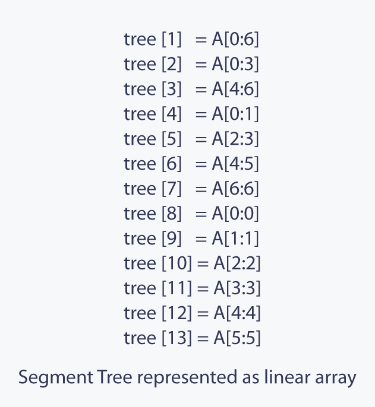

# Segment trees
## Usage
Segment tree is used where there are __Multiple range queries on array__ and 
__modifications of elements__ on the same array.

+ i.e. [Spoj Rangesum](https://www.spoj.com/problems/RANGESUM/fbclid=IwAR1mZQJiOUpais0ZMHYxaTpN5bdNnrg-Py3Q1vbBAL6s390340hrwv5fibI) this question has __two types__ of queries and __multiple queries__ which is _the best problem_ to solve using __Segment Tree__

## What is Segment Tree?
__Segment tree__ is a __binary tree__ used for _storing_ the _intervals_ or _segments_. Each node in the Segement Tree __represets an interval__. 
+ Consider an array _**A**_,size of array **_N_**,Segment Tree corresponding with the array **_T_**
    1. The __root__ of __*T*__ will represent the whole array **_A_**[0: **_N_**].
    2. Each leaf in the __Segment Tree__ __*T*__ will represent a single element (itself).
    3. If node _A1_ is __the parent__ of _A2_ & _A3_ and **_A1_[ I : J ]** 
        1. then **_A2_[ I : J/2 ]**  
        2. ___A3_[(J / 2) + 1 : J ]__
    4. The __Height__ of the Segment Tree will be  )

+ Once the Segment Tree is build, its structure cannnot be changed. We can __Update the values__ of nodes but we cannnot change its _structure_. __Segment tree__ _provides_ two operations:
    1. __Update:__ To update  the element of the array _**A**_ and reflect the corresponding change.
    2. __Query:__ In this operation we can query on an interval. __(return  a min/max/total..etc of that range)__

# Implementation:
Since a Segemnt Tree is a __binary tree__, a simple linear array can be used to _represent_ the Segment Tree.

A Segment Tree can be built using __recursion (bottom-up approach ).__Starting with leaves and going up to the root 
+ __*update()*__: search the leaf that contains the element to update. by going to either on __the left child__ or __the right child__ depending on the interval which contains the element. then we use the __bottom-up__ approach to update __the corresponding change__. 
+ __*query()*__: select a range from `L` to `R`, __Recurse__ on the tree starting from the root and check if the interval is completely in the range from `L` to `R`, if the interval represented by a node is completely in the range, return the __node's value__


>The Segment Tree of array __*A*__ size 7 will look like.
 
+ which will be represented as an array tree :


## Code Explaination
### Build Function
```c++
//Build Segment Tree from array v
void build(int u, int s, int e) {
	if (s == e) { 					//Reached a leaf
		seg[u] = v[s];
		return;
	}
	build(u * 2, s, (s + e) / 2);			//Call left child
	build(u * 2 + 1, (s + e) / 2 + 1, e);	//Call right child
	seg[u] = seg[u * 2] + seg[u * 2 + 1];	//Current node sum is left + right
}
```
The __build__ function takes __three parameters__ _(__node__ `u`,__start__ `s`,__end__ `e`)_ 
####1. Base case 
```c++
    if ( s == e) {
        seg[u]=v[s];
        return;
    }
```
if _the start_ and _the end_ of the __range__ are __equal__, then we exit _seg[u]_ is the node
of the tree where the  element of the array  is.

####2. Calling the left & right child
```c++
	build(u * 2, s, (s + e) / 2);		//Call left child
	build(u * 2 + 1, (s + e) / 2 + 1, e);	//Call right child
```
goes to the __left child__ [ **_U * 2_** ] first then we go to the __right child__ [ ___U * 2 + 1___ ]  
1. we sent to the _left child_ the __starting index__ [ ___S___ ] as _the start_ and the __mid index__ [ ___(S + E) / 2___ ] as _the end_.
2. we sent to the _right child_ the __index after mid__ [ ___(S + E) / 2___] as _the start_ and the __last index__ [ ___E___ ] as _the end_.

#### 3. Calculate Current node
```c++ 
    seg[u] = seg[u * 2] + seg[u * 2 + 1];
```
since in this Segment Tree we are __calculating the sum__ in a range we add the __child nodes__ ( `seg[u * 2]` , `seg[u * 2 + 1]` ) to the __parent__ ( `seg[u]` ).
here we can __change it__ to what ever we might need.

### Get Function
```c++
int get (int u, int s, int e){
    if (s > r || e < l)
        return 0;
    if (s >= l || e <= r)
        return seg[u];
    return get (u * 2, s, (s + e) / 2) + get (u * 2 +1, (s + e) / 2 + 1, e);
}
```
#### 1. Base Case ( two )
##### 1. out of range
```c++
    if( s > r || e < l) return;
```
this checks if we are out of __the range__ either our __start__ is after the _end_ of the _current node range_ `s > r` or our __end__ is _before_ the _start_ of the _current node_ `e < l`. 
##### 2. we are inside of range
```c++
    if( s >= l && e <= r ) {
        return seg[u];
    }
```
this checks if we are __inside the range__ which is our __start__ is _bigger or equal_ than the range ` s >= l` __while__ our __end__ is _smaller or equal_ than the range ` e <= r`. 
>the relation between start being >= than the range and end being <= than the range is AND '&&' not or


#### 2. RETURN
```c++ 
return get ( u * 2, s, (s + e) / 2) + get (u * 2 + 1, (s + e) / 2 + 1);
```
the first call gets the __Right child__ ` u * 2` , the second call gets the __Left child__ `u * 2 + 1` .
the first call gets the __first half of the range__ `[s , (s + e) / 2]`, the second call gets the __second half of the range__ `[(s + e) / 2 +1, e]`

### Update Function
```c++
void update ( int u, int s, int e) {
    if( s > r || e < l) return;
    if( s == e) {
        seg[u] = val;
        return;
    }
    update (u * 2, s, (s + e) / 2);
    update (u * 2 + 1, (s + e) / 2 + 1, e);
    seg[u] = seg[u*2] + seg[u*2+1];
}
```
this function change __one element__ `seg[u]` __to a Value__ `val`.

#### 1. Base Case
```c++
if ( s > r || e < l) return;
```
this is the same base case used in get function for checking if the __node__ is __out of range__

#### 2. if we found the element ( 2nd Base Case)
```c++
if( s == e) {
    seg[u] = val;
    return;
}
```
we check if we reached a leaf and didn't exit from the __out of range__ check then we set it to
the new value `seg[u] =val;` and since it's a _leaf_ we return and we don't travels more.

#### 3. calling the RIGHT and LEFT childs
```c++ 
update ( u * 2, s, (s + se) / 2);
update ( u * 2 + 1, (s + e) / 2 + 1, e);
```
these are same as always there is no new things.
> the first call gets the __Right child__ ` u * 2` , the second call gets the __Left child__ `u * 2 + 1` .
the first call gets the __first half of the range__ `[s , (s + e) / 2]`, the second call gets the __second half of the range__ `[(s + e) / 2 +1, e]`

#### 4. Calculating the new value 
```c++
seg[u] = seg[u*2] + seg[u*2+1];
```
this calculates the new __parent nodes__ base on _the change on the leaf_ which either _the left_ or _the right_ 


