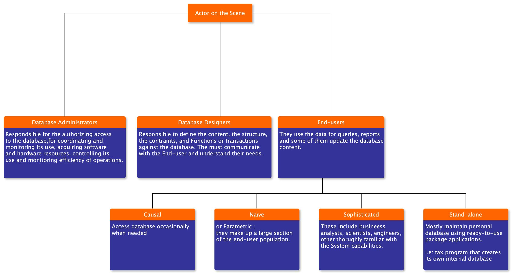

# Database and Database Users

> #### Types of Database and Database Applicatons
> ##### Traditional Applications:
>   + Numeric and Textual Databases
> ##### More Recent Applications:
>   + Mulimedia Databases
>   + Geographic Information Systems (GIS)
>   + Biological an Genome Databases
>   + Data warehouses
>   + Mobile Databases
>   + Real-time and Active Databases

### Definitions
+ __Database:__ A _Collection_ of __related__ data.
+ __Data:__ know facts that can be __*recorded*__ and have an **implicit _meaning_**.
+ __Mini-world:__ Some part of the real world about which **_data_ is stored** in a __database__. _i.e_ : students grades and rranscipts at a university.
+ __Database Management System (DBMS):__ A software __package/system__ to *facilitate* the __creation__ and __maintenance__ of a computerized database.
+ __Database System:__ The __DBMS__ software together with the __Data__ itself. Sometimes, the __applications__ are also included.

### Typical DBMS Functionality
+ Define a particular database in terms of its **Data types**, __structures__, and __constraints__.
+ __Construct__ or __Load__ the __*initial database* contents__ on a secondary storage medium.
+ _Manipulating_ the database:
    + __Retrieval__: *Querying*, generating reports
    + __Modification:__ __insertions__, __deletions__ and __updates__ to its content 
    + Accessing the database through Web applicatons
+ __Viewing__ : Processing and Sharing by a set of consurrent users and application programs - yet, keeping all data valid and consistent.

### Applications Acticities against a Database
+ Applications interact with a database by generating:
    + __Queries:__ that __access__ different parts of _data_ and _formulate_ the result of a _request_.
    + __Transations:__ that may read some data and "update: sertain valuse or fenerate new data and store that in teh database.

### Main characteristics of the Database Approach
+ self-describing nature of a database system.
+ Insulation betwen programs and data.
+ Data Abstraction.
+ Support of multiple views of the data.
+ Sharing of data and multi-user transaction processing.
  
#### Self-describing nature of a database system:
+ A DBMS __catalog__ stores the description of a particular database (e.g. __data structures__, __types__ and __contraints__).
+ The secription is called __meta-data__
+ This allows the __DBMS software__ to work with _**different**_ database applications.

#### Insulation betwen programs and data:
+ Called __Program-data independence__.
+ Allows changing __data structures__ and __storage organization__ _**without**_ having to change the DBMS access to programs.

### Data Abstraction
+ A __data model__ is used to hide _storage details_ and present the users with a __conceptual view__ of the database.
+ Programs refer to the __data model constructs__ rather than __data storage details__.

### Support of multiple view of the data:
+ Each user may see a different view of the database, which describes only the data of interest to that user.
  
### sharing of data and multi-user transavtion processing:
+ Allowing a set of __Concurrent users__ to __retrieve from__ and to __update__ the database.
+ __*Concurrency control*__ within the DBMS guarantees that each __transaction__ is correctly executed or aborted.
+ __*Recovery sub-systems*__ ensure teach completed transaction has its effect __permanently__ recored in teh database.
+ __OLTP__ (Online Transaction Processing) is a major part of database applications. This _allows_ hundreds of __Concurrent transactions__ to execute per second.

## Database Users
### Database Users may be divided into
1. Those who __actually use and control__ the database content.
    + those who design and maintain database applications( called "Actor __on the Scene__")
2. Those who design and develop the __*DBMS*__ software and __*related developement tools*__, and the __*computer systems operators*__ (called " Workers __behind the Scene__").

### Actors on the scene

### End-Users : Naïve or Parametric
+ They use perviously well-definde functions in the form of "canned transactions" against the database.
+ Users of Mobile Apps mostly fall in this category 
+ __Bank-tellers__ or __reservation clerks__ are paramteric users who do this activity for entire shift of operations.
+ __Social Media Users__ post and read information from websites 

### End-Users : Sophisticated:
+ these include business analysts, scientists, engineers, other thhoroughly familira with the system capabilities.
+ Many use tools in the form of software packages that work closely with the stored database.

## Advatages of Using the database approach
+ Controlling redundancy in data storage and in development and maintenance efforts.
+ Restricting unauthorized access to data.
    + i.e: Only the DBA staff uses privileged commands and facilites.
+ Provinding Persistent storage for program Obbjects
+ Providing optimization of queries for effiecient processing.
+ providing backup and recovery services.
+ providing multiple interfaces to different classes of users.
+ Representing complex relationships among data.
+ Enforcing integrity constraints on the database.
+ Drawing inferences and action from the stored data using deductive and active rules and triggers.

## Additional Implications of Using the database approach
+ Potential for enforcing standards.
+ Reduced application development time
+ Flexibility to change data structures
+ Availavility of current infrormation
+ Economies of scale
### Potential for enforcing standards:
+ This is very crucial for the success of database applications in large organizations . 
    + Standards refer to data items names, display formats, screeens, report structures, meta-data, web page layout, etc.

### Reduced application development time
+ Inceremental time to add each new appication is reduced.
  
### Flexibility to change data structures:
+ Database structure may evolve as new requirements are definded.

### Availabitiy of current information
+ Extre ely important for on-line transaction systems such as  shopping , airline, hotle, car reservations.

### Economies of scale
+ Wasteful overlap of resources and personnel can be avoided by consolidationg data and applications across depeartments.

## When not to use a DBMS
+ Main inhibitors (costs) of using a DBMS.
+ When a DBMS may be unnecessary
+ When a DBMS may be infeasible.
+ When a DBMS may be suffice.

