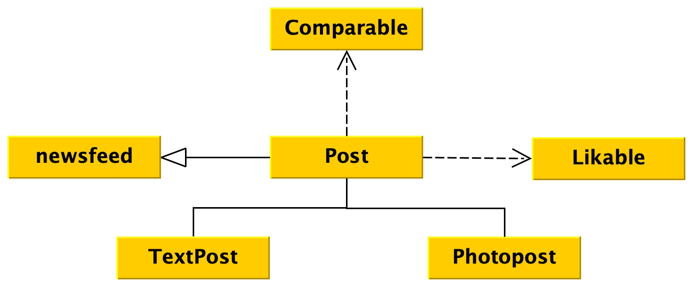

##              CIA Model 




#### Likable
```java 
public interface Likable {
    public void like();
    public int getLikes();
}
```
#### Post 
```java
public class Post implements Likable, Comparable {
    private String username;
    private String timeStamp;
    private int likeCount;
    public Post (String uName) {
        username=uName;
        Date now = Calender.getInstance().getTime();
        timeStamp = now.toString();
    }

    @override
    public void like () {
        likeCount ++;
    }

    @override
    public int getLikes() {
        return likeCount;
    }

    public String toString() {
        return "This post was created at :" + timeStamp + " by " +
        username + " with " + likeCount + " Likes";
    }
    public String getUserName () {
        return username;
    }
    public int compareTo (object other) {
        return timeStamp.compareTo( ((Post)other).timeStamp );
    }
}
```
+ `comparable` is a java default interface which we implemented the _function_ `compareTo (object other)`  which takes an object as a __parameter__.
+ __CompareTo function implemetion:__
    + we use `compareTo()` function of timeStamp [`String`]
    + we used `timeStamp` variable fromt the `other` class, which is __legal__ since, it's from the __same class type__.
```java 
return timeStamp.compareTo ( ( (Post)other ).timeStamp );
```  
#### Text Post
```java
public Class TextPost {
   private String caption;
    public PhotoPost ( String username,String caption ) {
        super (username);
        this.caption = caption;
    } 
}
```
#### Photo Post
``` java
public class PhotoPost extends Post {
    private String photoName , caption, fileName;
    public PhotoPost ( String username, String fileName, String photName, String caption ) {
        super (username);
        this.photoName = photoName;
        this.caption = caption;
        this.fileName = fileName;
    }
    public String toString() {
        return super.toString() + " photoName:" + photoName;
    }
    
}
```

#### NewsFeed

```java 
public class NewsFeed {
    private ArrayList<Post> postList;
    public Newsfeed() {
        postList = new ArrayList <Post> ();
    }
    public void add (Post p) {
        postList.add (p);
    }
    public Post getPost(int index) {
        return postList.get(i);
    }
}
```
+ this Class [`NewsFeed`] is using __Polymorphism__ i.e.:
    + `public void add (Post p)` we use `Post` as a _parameter_ instead of _implementing_ __one method__ for `PhotoPost` and __one method__ for `TextPhoto` we use a __single method__, using __polymorphism__ which can be used for `PhotoPost` and `TextPost`; 