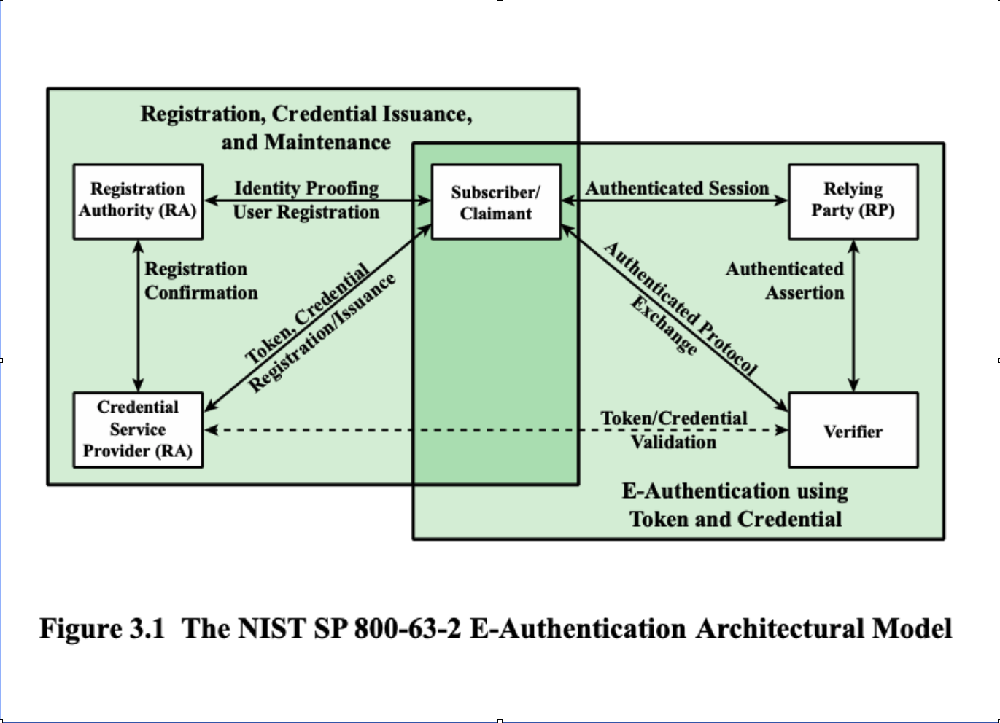
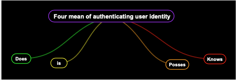

# Authentication

## Authentication Process

### Steps Authentication Process:

- Basis for access control and user accountability.
- Identification step

  - Presents a way to identify in the security system.
  - which means generates an Identifier to the security system.

- Verification step

  - Presents authentication information that corroborates the binding between the entity and the identifier.

### Example

For example, user Alice Toklas could have the user identifier ABTOKLAS

- This information needs to be stored on | any **server** or **computer** system | that Alice wishes to use | and could be know to system **administrators** and other **users**.
- A typical item of authentication information | associated with this user ID is a password, | which is kept **secret**.
- If no one is able to obtain | or guess Alice's password, | then the combination of | Alice's user ID and password | enables administrators to set up | Alice's access permissions and audit her activity.
- because _Alice's ID_ is **not secret**, | system users can send her e-mail, | but because her **password is secret**, | no one can **pretend** to be Alice.

- In essence,

  - identification: is the means by which | a user provides a claimed identity | to the system(**Is the way you tell the system who you are- _Username_**)
  - user authentication: is the means | of establishing the validity | of the claim. ( **Is the way to prove yourself - _Password_**).

- Note that **user authentication** is distinct from **message authentication**.

  - Message Authentication: is a procedure | that allows | communicating parties | to verify that | the content | of a received message | have not been altered | and that the source | is authentic.

### Electronic User Authentication Principles

- NIST definition **Electronic user authentication**:

  - as the process of establishing | confidence in user identities | that are presented electronically | to an information system.

- Systems can use the **authenticated identity** to | determine if the _individual_ is | authorized to | perform a particular functions, | such as database transactions | or | access to system resources.

## Model for User Authentication

- NIST Authentication Architectural Model 

### General model for user authentication

- A general model for user authentication that involves a number of : entities and procedures.
- The initial requirement for | performing user authentication | is that the user | must be registered with the system.
- The following is a typical sequence for registration:

  - An applicant applies to a **registration authority (RA)** to become a subscriber of a **credential service provider(CSP)**.

    - In this model, the RA is a trusted entity that establishes and vouches (guarantee) for the identity of an applicant to a **CSP.**

  - The **CSP** then engages in. an exchange with the subscriber.

    - Depending on the details of the overall authentication system, the **CSP** issues some sort of electronic credential to the subscriber.

  - the credential is a data structure that authoritatively binds an identity and additional attributes to token possessed by a subscriber and a can be verified when presented to the verifier in an authentication transaction.

  - the token could be an encryption key or an encrypted password that identifies the subscriber.

    - the token may be issued by the CSP generated directly by the subscriber, or provided by a third party.

  - the token and credential may be used in subsequent authentication events.

- Once a user is registered as a subscriber , the actual authentication process can take place between the subscriber and one or more systems that perform. authentication and, subsequently authorization.

  - the party to be authenticated is called a claimant and the party verifying the identity is called a verifier.

    - when ta claimant successfully demonstrates possession. and control of a token to verify through an authentication protocol, the verifier can verify that the claimant is the subscriber name in the corresponding credentials.

  - the verifier passes on an assertion (confirmation) about the identity of the subscriber to the relying party .

    - that assertion includes identity information about a subscriber, such as the subscriber name an identifier. assigned at registration, or other subscriber attributes that were verified in the registration process.

  - the RP can use the authentication information provided by the verifier to make access control or authorization decisions.

### The Four means of authenticating user identity are based on:

These four means can be used **alone** or in **combination**.

1. Something the individual **knows** `password`.
2. Something the individual **possesses** `token`.
3. Something the individual **is** `static biometrics [Fingerprint, retina, face]`.
4. Something the individual **does** `dynamic biometrics [Voice patterns, handwriting]`



#### Problems with some of the methods

- Passwords:

  - guess.
  - forge/steal.
  - authentic user can forget/loss password.

- Tokens:

  - authentic users can loss there tokens.

- Biometric authenticators:

  - Dealing with false positives (false alarms) and false negatives (security failure).

    ```
    - **False positive (false alarms)**: The authorized users are identified as intruders.
          - **False Negative (security failure)**:Intruders not identified as intruders.
              - by attempting to limit the false positives might increase the false negatives.
    ```

    ## Risk Assessments for User Authentication

     There are three separate concepts:

- `Assurance Level`: Describes an organization's **degree of certainty** that a user has presented a credential that refers to his or her identity.
- `Potential impact`: potential impact on organizations or individuals should there be a breach opf security
- `Areas of risk`
