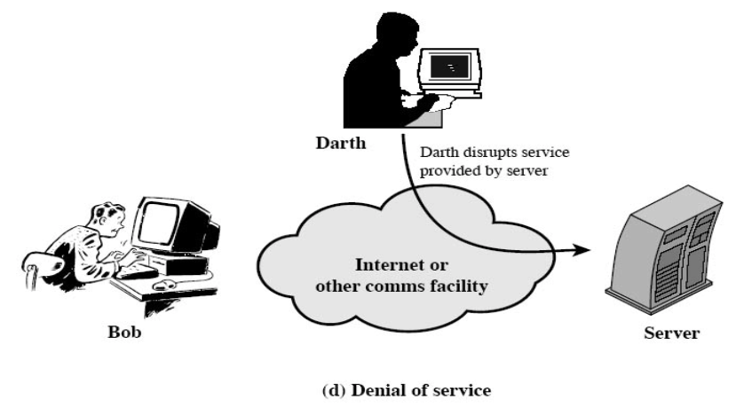

# Information systems Security

### Computer Security

**Computer security** deals with [computer related] _assets_ that are subject
to a variety of **Threats** and /for which/ various**Measures** are taken
to _protect_ those _assets_

**also COMPUTER SECURITY** is defined:

-   the protection of:
    -   **Integrity**
    -   **Availability**
    -   **Confidentiality**

### Network Security

[**Measures to _protect_ data _during_ their _transmission_**].

-   Describes the **policie** an **procedures** implemented by **network admin**
    -   to avoid and keep track of **unauthorized**:
        -   access
        -   exploitation
        -   modification
        -   DON [_Denial Of Network_]
        -   DONR [_Denial Of Network Resources_]

### Internet Security

[**Measure to _protect_ data _during_ their _transmission_**].

-   deals specifically with/ _Internet-based_ **Threats**
-   including:
    -   **hacking** : Unauthorized gain access to system -or- accout.
    -   **malware** : viruses or other malicious software.

### Network and Internet Security

consists of measures to :

-   deter
-   prevent
-   detect
-   correct
    **security violations** that involves the transmission of information.

#### Information security [definition]

the protection of **info systems** and it's **resources** _againist_:

1. accidental
2. intentional
   following actions:

-   _disclosure_ of **confiential data**
-   _modification_ of **data** -or- **programs**
-   _destruction_ of **data**, **software** -or- **hardware**

and **Ensuring non-repudiation**

###### info security [other def]

the _process_ and _methodologies_ keeping the info:

-   **confidential**
-   **available**
-   **assuring it's integrity**

#### Computer Security Objectives [ Three main keys ]

**1. CONFIDENTIALITY**
**2. INTEGRITY**
**3. AVAILABILITY**

#### 1. Confidentiality

ensure that :

-   _Computer-related assets_ are **accessed** only by **authorized parties**
-   **ONLY** those who **have accesss** to something will _actually_ get that **accesss**

confidentiality sometimes are called : `secrecy` or `privacy`
**confidentiality covers:**

1. `Data confidentiality`: Assures that _private_ or _confidential_ info is not made _available_ or _disclosed_ to **Unauthorized entities**
2. `privacy`: Assures that individuals control or influence what _info_ related to them may be **COLLECTED**.

#### 2. Integrity

`Assest` can be **modified** ONLY by **authorized parties** -or- **in authorized ways**.
**Data Integrity covers:**

1. `Data integrity`: Assures that info and programs are **modified** only in a _specified_ and _authorized_ manner.
2. `System integrity`: Assures that system **performs** it's **intended function** in a unimpaired manner.

#### 3. Availability

`Assets` are `accesssible` to **authorized parties** at appropriate times. meaning the service isn't **denied to authorized parties.**

#### CIA triad

**Confidentiality**, **Integrity**, **Availability** are often referred to as **CIA triad**.

#### Additional security concepts besides CIA triad

**1. Authenticity**
`def:` the property of being **genuine**, **verifiable**, and **Trusted**; _confidence_ in tthe **Validity** of a transmission.
**2. Accountability**
`def:` the ability that actions of an **entity** is tracable **uniquely** to `that entity`

-   this supports **nonrepudiation**, **deterence** and **fault isolation**

**Non-repudiation**
`def:` the **sender** or **generator** of the info `cannot` deny that he did send or generate that info.

**Access control**
ONLY **Authorized parties** can use specific resources.

##### Levels of impact from a breach

1. `low`
2. `moderate`
3. `high`

##### Countermeasures

`def:` is any means taken _to deal_ with a **security attack**

> ideally, a countermeasure can be devised to **prevent** attacks

-   when **prevention** fail the goal is:
    -   **detect** the attack
    -   **recover** from the _effects_ of the attack.

**Means used to deal with security attack**

1. `prevention`
2. `detection`
3. `recovery`

#### Security Terminology

-   `Adversary [threat agent]`: an entity that:
    -   **attacks** the system
    -   is a **threat** to the system
-   `Attack`: An **assault** on _system security_ that comes from :
    -   **intelligent** threat.[could be defined as: *threat in action*]
-   `Countermeasure`: An **action**, **device**, **procedure** that
    -   reduces a threat, vulnerability
    -   preventing or eliminating attacks by minimizing it's harm.
-   `Risk`: Expectation of loss expressed as a **probability** that:
    -   a particular **threat**
    -   will exploit a particular **vulnerability**
    -   with a particular **harmful result**
-   `security policy`: a set of rules that defines:
    -   how a **system** -or- **organization** provides
    -   security **services** to
    -   protect:
        -   sensitive system resources
        -   critical system resources
-   `System resource[Asset]`:
    -   Data store by the system
    -   services provided by the system
    -   system capabilities:
        -   processing power
        -   communication bandwidth
    -   hardware.
    -   housing facility.
-   `Threat`: **Potential** violation of security , that exist when a action that could breach security and cause harm.
-   `vulnerability`: a **Flaw** or \*_weakness_ in a system's design/implementation, or in system security policy.

#### Assets

1. `Hardware`
2. `Software`
3. `Data`
4. `Communication facilities and networks`

#### Computer and network assets with Threats example

|                                  | Availability                                           | Confidentiality                          | Integrity                                                    |
| -------------------------------- | ------------------------------------------------------ | ---------------------------------------- | ------------------------------------------------------------ |
| hardware                         | stolen, disable                                        | unencrypted disk is stolen               |                                                              |
| software                         | deleted                                                | an authorized copy made                  | modified to:1. cause faliure 2. unintended task              |
| data                             | deleted                                                | read,analysis revealing underlying data  | modified, fabricated                                         |
| communication lines and networks | messages :deleted/destroyed [they]:renered unavailable | message: read, traffic pattern: observed | messages:modifies, delayed, reordered, duplicated,fabricated |

## Network Security Attacks

Types of network security attacks:

1. `passive attacks`: **learn** or **make use** of info from the system, that doesn't have an affect on the system.
2. `active attacks` : **altering** system resource or **affect** their operation

Types of threats:

1. `Interception` [__Passive Attack__]
2. `Interruption`
3. `Modification`
4. `Fabrication`

#### 1. Interception (Eavesdropping)

> Attack on **Confidentiality**

-   Information disclosure/leakage. An unauthorized party gains access to an asset.

-   unauthorized party could be:
    -   `person`
    -   `program`
    -   `computer`

#### 2. Interruption (Jamming)

> Attack on **Avalability**

-   Action of **preventing** a message from reaching its intended reciptient.
-   An **asset** of the system is `destroyed` or becomes [`unavailable` or `unusable`].
-   **DOS** - Denial Of Service Attack

#### 3. Modification (Tampering)

> Attack on **Integrity**

-   An **unauthorized party** `gains access` + `tampers`(alter) with assets
-   An **unauthorized party** `alters` the content of a _message_ which's **transmitted between entities**
-   Countermeasure:
    -   Cryptographic technique :
        -   cehcksums.
        -   digital signature.

#### 4. Fabrication (Impersonation)

> Attack on **authenticity**

-   an **unauthorized party** `inserts` counterfeit objects into the system.
-   **Allows** to bypass the _authenticity check_
-   Countermeasure:
    -   cryptographic techinque.

##### Attacks Summary

-   the only `passive attack` was the **interception** .
-   interception listen and analysis info only.
-   `interruption` doesn't care about the info, targets the service/system itself.
-   `modification` [with messages/transmition]:
    -   intercepts[reads] the connection,
    -   interrupts it [stopping other entities from recieving it]
    -   fabricates a new message
-   `modification` [data/programs]:
    -   edits data and programs to change the systems functionality
-   `Fabrication` :
    -   sends counterfeit objects into the system
    -   creates a new object doesn't depend on transmissions or data on the system

###### attacks can be categorized in two ways:

-   **type**/**effect**:
    -   `passive`: learn/make use of info
    -   `active`: alter system resources/operations
-   **source**:
    -   `insider`: inside security parameters
    -   `outsider`: outside security parameters

### Passive Attacks

all passive attacks are _Interception_, but there is two different types

1. **Release** of _message_ **content**
2. Traffic **analysis**

##### 1. Release of message content

-   tapping Conversations, interceting emails/file transfers
-   reads contents of messages.

##### 2. Traffic Analysis

-   **obvserver** patterns of messages
-   used on _masked messages_
-   used to get information **traffic**(`frequency`, `location`, `identities`),and extract useful info from it.

#### Passive attack summary

1. release of message content: leak it
2. traffic analysis: stalk

-   `passive attacks` are **difficult** to detect; doesn't involve _any_ data **alteration**
-   `passive attacks` we emphasis
    -   **Prevention**
    -   `over`
    -   **detection**

### Active attacks

active attack can be :

1. `interruption`
1. `modification`
1. `fabricaton`

active attacks four categories:

1. `Replay` [Modification]
2. `Masquerade` [fabrication]
3. `Modification of message` [Modification]
4. `Denial Of Service` DOS [Interruption]

##### 1. Replay

involves:

1. the **passive capture** of a data unit
2. it's subsequent **retransmission** (the same message)
3. to produce **unauthorized effect**

-   Intercept -> Replay -> Masquerade

##### 2. Masquerade

one entity **pretends** to be a different entity.

-   pretening to be an authorized party.

##### 3. Modification of message

1. **Portion** of a legitimate message is **altered**
2. the message is **delayed**/**reordered**

-   which is meant to produced an **unauthorized effect**

##### 4. Denial Of Service

-   prevents the normal use or management of the communication facilities
-   has specific targets
    1. all messages directed to a destination
    2. disruption of an entire network:
        - over loading.
        - disabling the network.

`simple def:` an attempt to **stop** a system to _provide services_

# Extra ?

### Hacker VS Intruder

##### Hacker

someone with no malign intent, breaks and enters a computer system

##### Intruder

someone who seeks to exploit computer assets for their own gain.

### Fundamental Security Design

-   Economy of Mechanism
-   Fail-safe default
-   Complete mediation
-   Open Design
-   Separation of privilege
-   Least privilege
-   least common mechanism
-   psychological acceptability
-   Isolation
-   Encapsulation
-   Modulatrity
-   Layering
